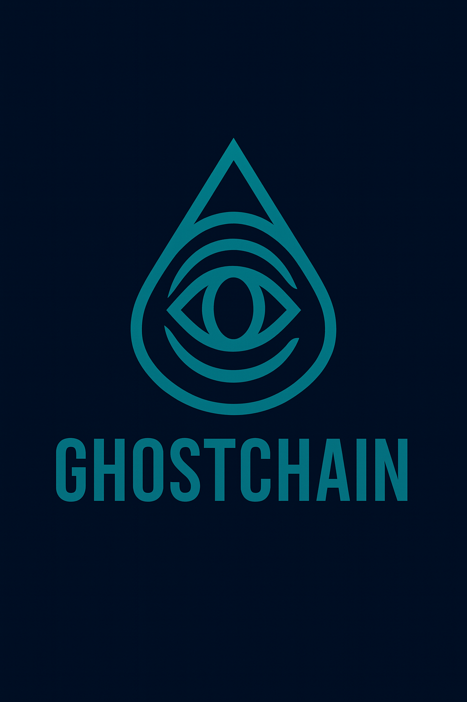
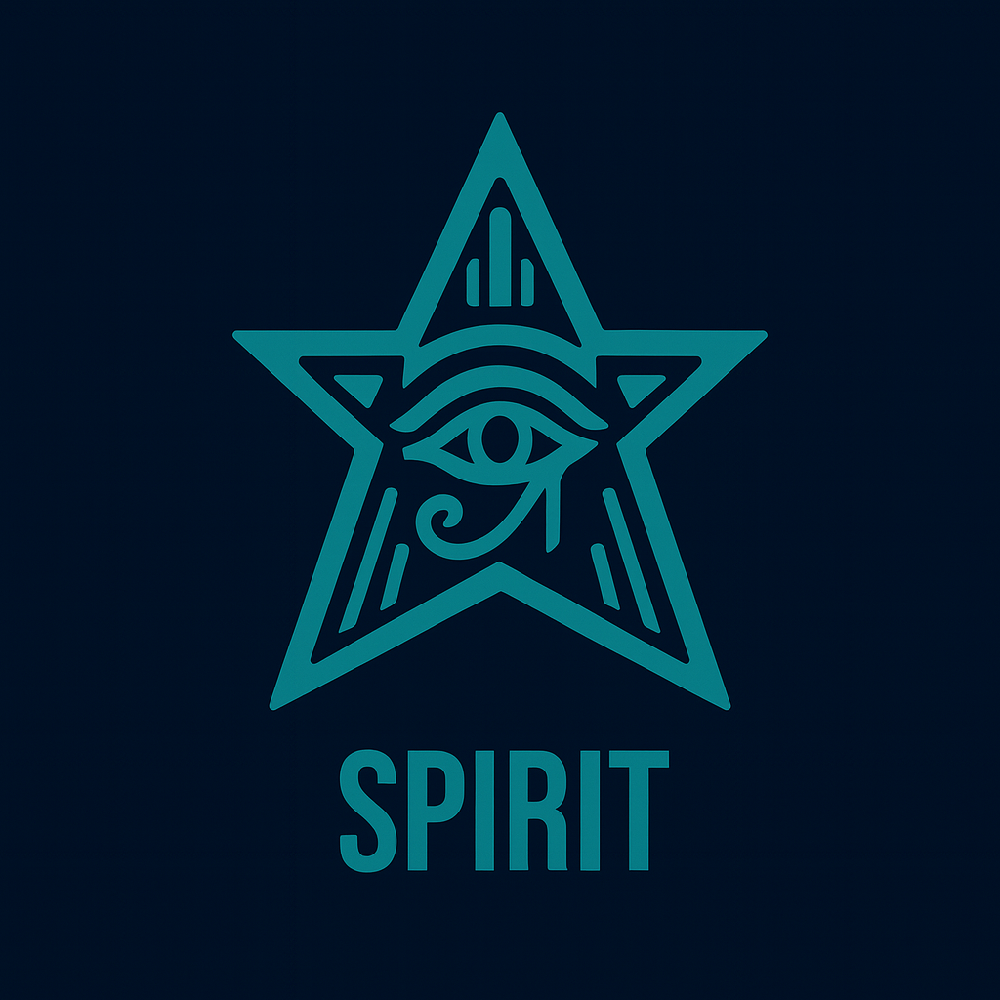
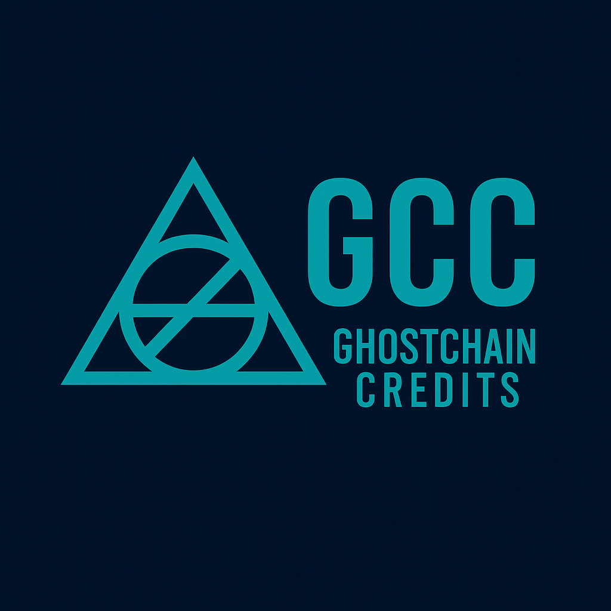
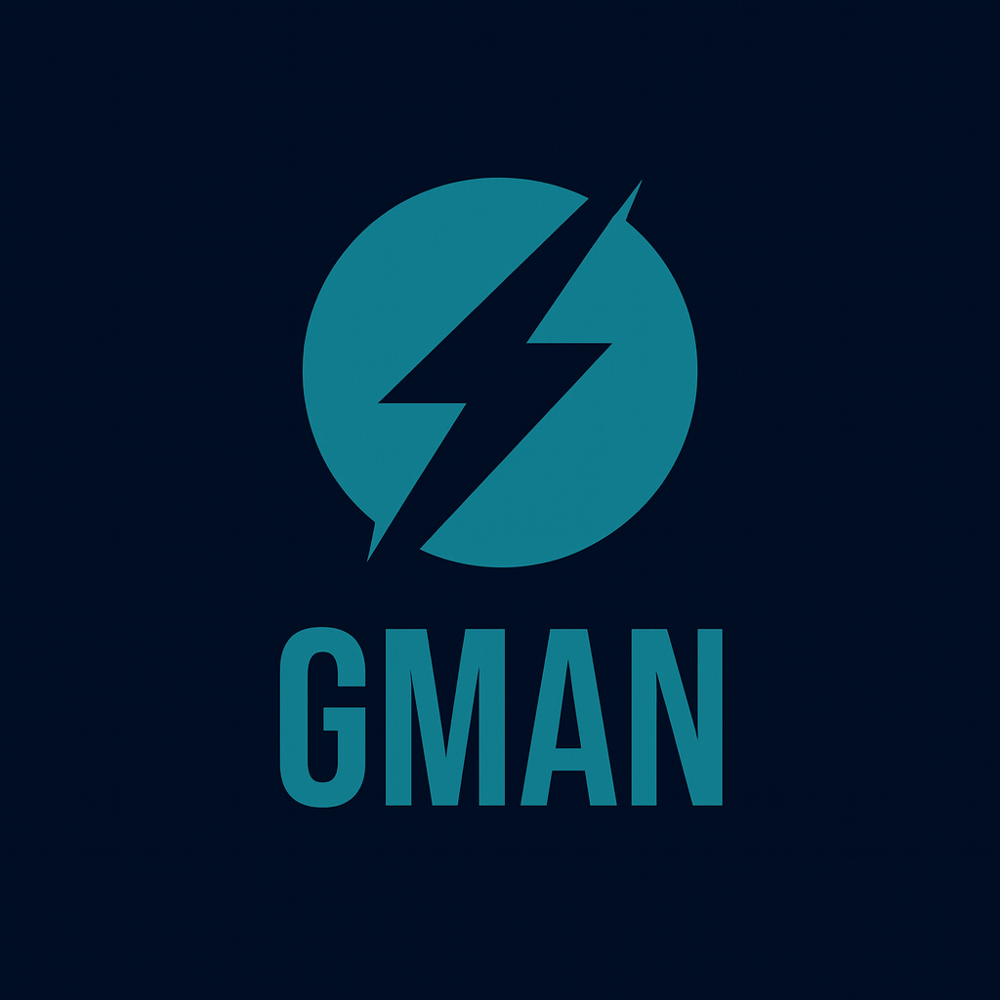

<p align="center">
  
</p>

# 👻 GhostChain

[](https://www.rust-lang.org/)
[](https://doc.rust-lang.org/book/ch14-03-cargo-workspaces.html)
[](https://github.com/ghostkellz/gquic)
[](https://www.docker.com/)
[](LICENSE)

> **High-performance blockchain platform** with integrated wallet services, built on Rust workspace architecture with GQUIC transport, GCRYPT cryptography, and GhostPlane L2 written in Zig.

---

## 🏗️ **Workspace Architecture**

GhostChain uses a **modern Rust monorepo workspace** for unified development across all services:

```
ghostchain/
├── 📦 Cargo.toml (workspace root)
├── 🔧 core/           # Blockchain implementation (ghostchain-core)
├── 🔗 shared/         # Common types, crypto, FFI (ghostchain-shared)
├── 👻 ghostd/         # Blockchain daemon with GQUIC
├── 💼 gwallet/        # Ghost Wallet daemon
├── 📒 gledger/        # GhostChain Ledger service
├── 🌐 cns/            # Crypto Name Server (formerly ZNS)
├── 🖥️ rvm/            # Rust Virtual Machine (formerly ZVM)
├── 🔏 rsig/           # Rust Signer service (formerly ZSIG)
├── 🆔 gid/            # Ghost ID system (identity management)
├── 🔐 keystone/       # Key management service
├── 🌉 ghostplane/     # Layer 2 blockchain (Zig-based)
├── 🧪 integration-tests/  # Cross-service testing
├── 🐳 docker/         # Container deployment
├── 📋 scripts/        # Build and development tools
├── 📚 reference-docs/  # Brainstorming and planning documents
├── 📁 archive/        # Archived/replaced documentation
└── 📂 archive-zig/    # Original Zig implementations (reference)
```

## 🚀 **Core Services**

### 👻 **GhostD** - Blockchain Daemon
High-performance blockchain node with consensus and mining capabilities.

**Features:**
- **GQUIC Transport**: Ultra-fast QUIC/HTTP3-based networking ([gquic](https://github.com/ghostkellz/gquic))
- **GCRYPT Security**: Advanced cryptographic operations ([gcrypt](https://github.com/ghostkellz/gcrypt))
- **Mining & Consensus**: Automated block production and validation
- **Multi-Domain CNS**: ENS, Unstoppable, Web5, and native Ghost domains
- **Smart Contracts**: Full contract execution with gas metering via RVM
- **Performance Monitoring**: Real-time metrics and optimization

```bash
# Start mainnet node
ghostd start --enable-quic --enable-mining

# Start testnet for development
ghostd start --testnet --bind-address 0.0.0.0:8545

# Get blockchain status
ghostd status
```

### 💼 **GWALLET** - Ghost Wallet Service
Advanced wallet management with multi-algorithm support and identity services.

**Features:**
- **Multi-Algorithm**: Ed25519, Secp256k1, Secp256r1 support via GCRYPT
- **HD Wallets**: Hierarchical deterministic key management
- **Ghost ID (GID)**: Decentralized identity management system
- **Hardware Support**: Ready for hardware wallet integration
- **GQUIC Integration**: High-performance transport
- **Keystone Integration**: Secure key management

```bash
# Start wallet daemon
gwallet start --enable-quic

# Create new wallet
gwallet wallet create main --algorithm ed25519

# Create identity
gwallet identity create alice --key-algorithm ed25519

# Send tokens
gwallet wallet send main 0xabc... 1.5 --token GSPR
```

## 🚀 **Core Services & Components**

### 🌉 **GhostPlane** - Layer 2 Blockchain
High-performance Layer 2 solution built in Zig for scalability and speed.

**Features:**
- **Zig Implementation**: Native performance with memory safety
- **Cross-Chain Bridge**: Seamless interaction with main chain
- **Optimistic Rollups**: Fast transaction processing
- **ZQLITE Integration**: Crypto-native database ([zqlite](https://github.com/ghostkellz/zqlite))
- **FFI Bindings**: Rust interoperability for main chain communication

### 🌐 **CNS** - Crypto Name Server
Multi-domain name resolution system (formerly ZNS).

**Supported Domains:**
- ENS (.eth)
- Unstoppable Domains
- Web5 DIDs
- Ghost native domains (.ghost)

### ⚙️ **RVM** - Rust Virtual Machine
Smart contract execution environment (formerly ZVM).
- Full EVM compatibility
- Gas optimization
- Contract verification

### 📒 **GLEDGER** - GhostChain Ledger
Distributed ledger service for transaction management.
- High-throughput processing
- State management
- Query optimization

### 🔐 **Additional Services**
- **RSIG**: Transaction signing service
- **GID**: Ghost Identity system for decentralized identity
- **Keystone**: Secure key management and storage
- **Jarvis**: AI-powered blockchain assistance

## 🌐 **Token Ecosystem**

- **🌟 GSPR (Ghost Spirit)**: Primary native token (21B max supply) 
- **💎 GCC (GhostChain Credits)**: Utility token for contracts and operations 
- **⚡ GMAN (Ghost Mana)**: Governance and staking rewards (earned through participation) 
- **🔮 SOUL**: Non-transferable identity tokens

*Token icons available in [assets/gcc-tokens/](assets/gcc-tokens/) directory*

## 🔧 **Quick Start**

### Option 1: Docker Deployment (Recommended)
```bash
# Development environment
./scripts/start-dev.sh

# Full production stack
docker-compose up --build

# Testnet only
docker-compose -f docker-compose.dev.yml up
```

### Option 2: Native Build
```bash
# Build entire workspace
cargo build --release --workspace

# Run specific service
cargo run --bin ghostd -- start --testnet
cargo run --bin gwallet -- start --testnet
```

### Option 3: Individual Services
```bash
# Install and run ghostd
cargo install --path ghostd
ghostd start --testnet

# Install and run gwallet
cargo install --path gwallet
gwallet start --testnet
```

## 🐳 **Docker Services**

The docker-compose setup includes:

- **ghostd/gwallet**: Main blockchain and wallet services
- **ghostd-testnet/gwallet-testnet**: Development testnet
- **Redis**: Caching and session storage
- **PostgreSQL**: Analytics and indexing
- **Nginx**: Reverse proxy and load balancing
- **Prometheus/Grafana**: Monitoring and visualization

**Service Ports:**
- GhostD RPC: `8545` (mainnet), `18545` (testnet)
- GhostD API: `8547` (mainnet), `18547` (testnet)
- GWallet API: `8548` (mainnet), `18548` (testnet)
- Grafana: `3000` (admin: `ghostchain_admin`)
- Prometheus: `9090`

## 🔐 **Security & Features**

### Cryptography
- **GCRYPT Integration**: Ed25519, Secp256k1, Blake3, SHA256 ([gcrypt](https://github.com/ghostkellz/gcrypt))
- **Quantum-Ready**: Post-quantum cryptography support planned
- **Hardware Integration**: YubiKey and hardware wallet support via Keystone
- **RSIG**: Rust-based signing service for transaction security

### Transport
- **GQUIC**: High-performance QUIC implementation ([gquic](https://github.com/ghostkellz/gquic))
- **GhostBridge**: gRPC over QUIC for service communication
- **IPv6 First**: Native IPv6 support with dual-stack fallback

### Performance
- **Async Runtime**: Full Tokio async/await implementation
- **Multi-Level Caching**: Advanced caching with LRU and TTL
- **Connection Pooling**: Optimized service communication
- **Batch Processing**: High-throughput transaction processing

## 📚 **Documentation**

### Core Documentation
- **[AUTH.md](AUTH.md)**: Authentication and authorization
- **[SMARTCONTRACT.md](SMARTCONTRACT.md)**: Smart contract development
- **[PROTOCOLS.md](PROTOCOLS.md)**: Network protocols and standards
- **[DOMAINS.md](DOMAINS.md)**: Multi-domain name system (CNS - Crypto Name Server)
- **[WEB5.md](WEB5.md)**: Web5 and DID integration
- **[TOKEN.md](TOKEN.md)**: Token economics and management

### Development
- **[CLAUDE.md](CLAUDE.md)**: Architecture and development notes
- **[CONTRACT.md](CONTRACT.md)**: Contract deployment and management
- **[IDENTITY.md](IDENTITY.md)**: Identity and RealID / GID integration
- **[WALLET.md](WALLET.md)**: Wallet development and API

### Reference
- **[archive/](archive/)**: Replaced and historical documentation
- **[archive-zig/](archive-zig/)**: Original Zig implementations for reference

## 🛠️ **Development**

### Building from Source
```bash
# Clone repository
git clone https://github.com/ghostkellz/ghostchain.git
cd ghostchain

# Build workspace
cargo build --workspace

# Run tests
cargo test --workspace

# Run integration tests
cargo test --package ghostchain-integration-tests
```

### Development Environment
```bash
# Start development stack
./scripts/start-dev.sh

# Build Docker images
./scripts/docker-build.sh

# Check services
curl http://localhost:8547/api/v1/status
curl http://localhost:8548/health
```

## 🗺️ **Roadmap**

### ✅ **Completed (v0.3.0)**
- Rust-based monorepo workspace architecture
- GhostD blockchain daemon with GQUIC
- GWALLET secure wallet service
- Multi-service Docker deployment
- RVM smart contract execution engine
- CNS multi-domain name resolution (ENS, UD, Web5, Ghost)
- GCRYPT and GQUIC crate integration
- Performance monitoring and optimization

### 🚧 **In Progress**
- GhostPlane L2 implementation in Zig
- GQUIC FFI integration completion
- GhostBridge Rust/Zig interop
- RSIG transaction signing service
- GLEDGER distributed ledger
- GID identity system
- Keystone key management
- Hardware wallet integration via Keystone
- ZQLITE database integration

### 📋 **Planned**
- Full GhostPlane L2 deployment
- Web5 DID full implementation via GID
- Zero-knowledge proof integration
- Cross-chain interoperability
- Mobile GWALLET applications
- Decentralized exchange (DEX)
- Jarvis AI integration
- Complete migration from Zig components to Rust (except GhostPlane)

## 🤝 **Contributing**

1. **Fork** the repository
2. **Create** a feature branch (`git checkout -b feature/amazing-feature`)
3. **Build** and test (`cargo test --workspace`)
4. **Commit** changes (`git commit -m 'Add amazing feature'`)
5. **Push** to branch (`git push origin feature/amazing-feature`)
6. **Open** a Pull Request

## 📄 **License**

This project is licensed under the **Apache License 2.0** - see the [LICENSE](LICENSE) file for details.

## 👤 **Author**

Built by [@ghostkellz](https://github.com/ghostkellz) as part of the **GhostMesh** ecosystem.

---

**🔗 Related Projects:**
- [GQUIC](https://github.com/ghostkellz/gquic) - High-performance QUIC implementation (Rust)
- [GCRYPT](https://github.com/ghostkellz/gcrypt) - Cryptographic library (Rust)
- [ZQLITE](https://github.com/ghostkellz/zqlite) - Crypto-native database (Zig)
- [RVM](https://github.com/ghostkellz/rvm) - Rust Virtual Machine
- [GhostBridge](https://github.com/ghostkellz/ghostbridge) - Cross-service communication

*For additional documentation: [reference-docs/](reference-docs/) for brainstorming and planning, [archive/](archive/) for replaced docs, and [archive-zig/](archive-zig/) for original Zig implementations.*
