# 🏗️ GhostChain Services Architecture

> Comprehensive overview of all services in the GhostChain ecosystem

---

## 📋 **Service Overview**

GhostChain follows a microservices architecture where each component runs as an independent daemon with its own API, configuration, and database. This enables:

- **Independent scaling** and deployment
- **Service isolation** and fault tolerance
- **Modular development** and testing
- **Clear API boundaries** between components

---

## 🚀 **Core Services**

### **ghostd** - Blockchain Daemon
- **Port**: 8545 (RPC), 8546 (WebSocket), 30303 (P2P)
- **Purpose**: Core blockchain node, consensus, block production
- **Status**: ✅ Implemented
- **CLI**: `ghostd --rpc-port 8545 --p2p-port 30303`

### **walletd** - Wallet Daemon
- **Port**: 8548 (Wallet API)
- **Purpose**: Wallet management, key storage, transaction signing
- **Status**: ✅ Implemented
- **CLI**: `walletd --port 8548 --keystore-path ./keys`

---

## 🌐 **Identity & Domain Services**

### **cns** - Crypto Name Service
- **Port**: 8553 (RPC), 53 (DNS), 8553 (DNS-over-HTTPS)
- **Purpose**: Multi-domain resolution and registration
- **Status**: ✅ Implemented
- **Features**:
  - Native domains: `.ghost`, `.gcc`, `.warp`, `.arc`, `.gcp`
  - Bridge to ENS (`.eth`), Unstoppable Domains (`.crypto`, `.nft`)
  - Web5 DID resolution (`did:ghost:*`)
  - Domain caching and performance optimization
- **CLI**: `cns --rpc-port 8553 --dns-port 53 --enable-ens --enable-web5`

### **gid** - Ghost Identity Service
- **Port**: 8552 (RPC), 9552 (gRPC)
- **Purpose**: Decentralized identity management (DID)
- **Status**: ✅ Implemented
- **Features**:
  - DID format: `did:ghost:identifier`
  - Public key management (Ed25519, Secp256k1, BLS)
  - Permission-based access control
  - CNS domain linking
  - Soulbound identity options
  - Access token creation and verification
- **CLI**: `gid --rpc-port 8552 --grpc-port 9552`

---

## 🔐 **Security & Ledger Services**

### **gsig** - Ghost Signature Service
- **Port**: 8554 (RPC), 9554 (gRPC)
- **Purpose**: Cryptographic signing and verification
- **Status**: ✅ Implemented
- **Features**:
  - Multiple algorithms: Ed25519, Secp256k1, BLS, Post-Quantum
  - Key generation and secure storage
  - Message hashing (SHA256, Blake3, Keccak256)
  - Batch signature operations
  - Hardware Security Module (HSM) ready
- **CLI**: `gsig --rpc-port 8554 --grpc-port 9554 --max-keys 1000`

### **gledger** - Ghost Ledger Service
- **Port**: 8555 (RPC), 9555 (gRPC)
- **Purpose**: Transaction processing and state management
- **Status**: ✅ Implemented
- **Features**:
  - Double-entry accounting system
  - 4-token economy (GCC/SPIRIT/MANA/GHOST)
  - Transaction journal with audit trails
  - Balance management and token locking
  - Mint/burn operations with authorization
  - Identity-aware transactions (GID integration)
- **CLI**: `gledger --rpc-port 8555 --grpc-port 9555 --enable-audit`

---

## ⚡ **Performance & Integration Services**

### **ghostplane** (Zig L2) - Layer 2 Service
- **Port**: 9090 (gRPC), 9091 (WebSocket)
- **Purpose**: High-performance L2 rollups and state channels
- **Status**: 🚧 External (github.com/ghostkellz/ghostplane)
- **Features**:
  - Zig-based execution for maximum performance
  - ZK-proof generation for L1 settlements
  - Rust ↔ Zig FFI bridge via `ghostbridge`
  - Batch transaction processing (>50k TPS target)
- **CLI**: `ghostplane --l1-endpoint http://ghostd:8545 --grpc-port 9090`

### **wraith** (Zig Proxy) - HTTP/3 Reverse Proxy
- **Port**: 443 (HTTPS), 80 (HTTP), 8080 (Admin)
- **Purpose**: Web5 gateway and high-performance proxy
- **Status**: 🚧 External (github.com/ghostkellz/wraith)
- **Features**:
  - HTTP/3 QUIC-based reverse proxy
  - CNS domain routing (*.ghost → services)
  - Web2/Web3/Web5 bridge functionality
  - TLS termination and caching
- **CLI**: `wraith --https-port 443 --admin-port 8080 --cns-endpoint http://cns:8553`

---

## 🗄️ **Data & Storage Services**

### **zqlite** (Zig Database) - Post-Quantum Database
- **Port**: 5432 (PostgreSQL-compatible)
- **Purpose**: Encrypted, post-quantum secure database
- **Status**: 🔗 External (github.com/ghostkellz/zqlite)
- **Features**:
  - ML-KEM-768 encryption at rest
  - Dilithium post-quantum signatures
  - Rust FFI for seamless integration
  - ACID transactions with cryptographic integrity
- **CLI**: `zqlite --port 5432 --data-dir ./data --encryption=ml-kem-768`

---

## 🤖 **AI & Automation Services**

### **jarvis** - AI Blockchain Assistant
- **Port**: 8559 (RPC), 9559 (gRPC)
- **Purpose**: AI-powered blockchain automation and monitoring
- **Status**: 🔗 External (github.com/ghostkellz/jarvis)
- **Features**:
  - Smart contract auditing and optimization
  - Transaction pattern analysis
  - Automated incident response
  - Performance monitoring and alerts
- **CLI**: `jarvis --rpc-port 8559 --blockchain-endpoint http://ghostd:8545`

---

## 🔧 **Development & Integration Services**

### **rvm** - Rust Virtual Machine
- **Purpose**: Smart contract execution engine
- **Status**: 🔗 External (github.com/ghostkellz/rvm)
- **Features**:
  - Native Rust + WASM hybrid execution
  - GhostChain opcode extensions
  - Gas metering with 4-token support
  - Identity-aware contract execution
- **Integration**: Embedded in `ghostd`

### **ghostbridge** - Rust ↔ Zig FFI Bridge
- **Purpose**: Safe Rust-Zig interoperability
- **Status**: 🔗 External (github.com/ghostkellz/ghostbridge)
- **Features**:
  - Zero-copy data exchange
  - Memory-safe FFI bindings
  - Error handling across language boundaries
- **Integration**: Used by `ghostplane`, `wraith`, `zqlite`

### **etherlink** - gRPC Client Library
- **Purpose**: High-performance gRPC communications
- **Status**: 🔗 External (github.com/ghostkellz/etherlink)
- **Features**:
  - Service discovery and load balancing
  - Connection pooling and retry logic
  - Protocol buffer schema management
- **Integration**: Used by all services for inter-service communication

---

## 🌊 **Service Communication Flow**

```mermaid
graph TB
    User[👤 User] --> Wraith[wraith:443]
    Wraith --> CNS[cns:8553]
    Wraith --> GhostD[ghostd:8545]

    GhostD --> GLedger[gledger:8555]
    GhostD --> GSig[gsig:8554]
    GhostD --> GID[gid:8552]

    CNS --> GID
    GLedger --> GID
    GSig --> GID

    GhostD --> GhostPlane[ghostplane:9090]
    GhostPlane --> ZQLite[zqlite:5432]

    Jarvis[jarvis:8559] --> GhostD
    Jarvis --> GLedger
    Jarvis --> GSig

    WalletD[walletd:8548] --> GhostD
    WalletD --> GSig
    WalletD --> GID
```



---

## 🚀 **Port Allocation**

| Service | RPC Port | gRPC Port | Special Ports | Status |
|---------|----------|-----------|---------------|---------|
| **ghostd** | 8545 | 9545 | 8546 (WS), 30303 (P2P) | ✅ |
| **walletd** | 8548 | - | - | ✅ |
| **gid** | 8552 | 9552 | - | ✅ |
| **cns** | 8553 | 9553 | 53 (DNS) | ✅ |
| **gsig** | 8554 | 9554 | - | ✅ |
| **gledger** | 8555 | 9555 | - | ✅ |
| **jarvis** | 8559 | 9559 | - | 🔗 |
| **ghostplane** | - | 9090 | 9091 (WS) | 🚧 |
| **wraith** | - | - | 443 (HTTPS), 8080 (Admin) | 🚧 |
| **zqlite** | - | - | 5432 (PostgreSQL) | 🔗 |

---

## 🐳 **Docker Compose Example**

```yaml
version: '3.8'
services:
  ghostd:
    build: ./ghostd
    ports:
      - "8545:8545"   # RPC
      - "8546:8546"   # WebSocket
      - "30303:30303" # P2P
    depends_on: [gledger, gsig, gid]

  gid:
    build: ./gid
    ports:
      - "8552:8552"   # RPC
      - "9552:9552"   # gRPC

  cns:
    build: ./cns
    ports:
      - "8553:8553"   # RPC
      - "53:53/udp"   # DNS
    depends_on: [gid]

  gsig:
    build: ./gsig
    ports:
      - "8554:8554"   # RPC
      - "9554:9554"   # gRPC

  gledger:
    build: ./gledger
    ports:
      - "8555:8555"   # RPC
      - "9555:9555"   # gRPC
    depends_on: [gid, gsig]

  walletd:
    build: ./walletd
    ports:
      - "8548:8548"   # Wallet API
    depends_on: [ghostd, gsig, gid]

  ghostplane:
    image: ghostplane:latest
    ports:
      - "9090:9090"   # gRPC
      - "9091:9091"   # WebSocket
    environment:
      - L1_ENDPOINT=http://ghostd:8545
    depends_on: [ghostd, zqlite]

  wraith:
    image: wraith:latest
    ports:
      - "443:443"     # HTTPS
      - "80:80"       # HTTP
      - "8080:8080"   # Admin
    environment:
      - CNS_ENDPOINT=http://cns:8553
    depends_on: [cns, ghostd]

  zqlite:
    image: zqlite:latest
    ports:
      - "5432:5432"   # PostgreSQL-compatible
    volumes:
      - zqlite-data:/data
    environment:
      - ZQLITE_ENCRYPTION=ml-kem-768

volumes:
  zqlite-data:
```

---

## 🧪 **Service Testing**

### **Health Checks**
```bash
# Check all services
curl http://localhost:8545/health  # ghostd
curl http://localhost:8548/health  # walletd
curl http://localhost:8552/health  # gid
curl http://localhost:8553/health  # cns
curl http://localhost:8554/health  # gsig
curl http://localhost:8555/health  # gledger
```

### **Integration Tests**
```bash
# Run service-specific tests
cargo test -p ghostd
cargo test -p walletd
cargo test -p gid
cargo test -p cns
cargo test -p gsig
cargo test -p gledger

# Run integration tests
cargo test -p integration-tests
```

---

## 📊 **Performance Targets**

| Service | Throughput | Latency | Memory | Notes |
|---------|------------|---------|---------|-------|
| **ghostd** | 1,000 TPS | <100ms | <2GB | L1 blockchain |
| **ghostplane** | 50,000 TPS | <10ms | <1GB | L2 rollups |
| **cns** | 10,000 RPS | <5ms | <500MB | Domain resolution |
| **gid** | 5,000 RPS | <10ms | <300MB | Identity ops |
| **gsig** | 1,000 SPS | <5ms | <200MB | Signature ops |
| **gledger** | 10,000 TPS | <20ms | <1GB | Accounting |
| **wraith** | 100,000 RPS | <1ms | <500MB | HTTP proxy |

---

## 🔮 **Future Services**

### **Planned Services**
- **gvm** - Ghost Virtual Machine (enhanced RVM)
- **gdns** - Native DNS server with blockchain records
- **gminer** - Consensus and mining service
- **gbridge** - Cross-chain bridge service
- **gvault** - Secure key management service

### **Integration Roadmap**
1. **Phase 1**: Core services (ghostd, walletd, gid, cns, gsig, gledger)
2. **Phase 2**: L2 integration (ghostplane, wraith, zqlite)
3. **Phase 3**: AI automation (jarvis) and advanced features
4. **Phase 4**: Cross-chain and enterprise features

---

## 🎯 **Getting Started**

```bash
# Start all core services
cargo run --bin ghostd &
cargo run --bin walletd &
cargo run --bin gid &
cargo run --bin cns &
cargo run --bin gsig &
cargo run --bin gledger &

# Or use Docker Compose
docker-compose up -d

# Verify services are running
curl http://localhost:8545/health
curl http://localhost:8553/ping
```

---

This architecture provides a robust, scalable foundation for the GhostChain ecosystem with clear separation of concerns and modern microservices best practices.